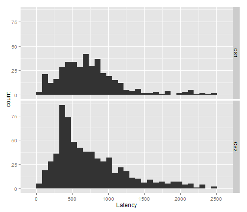
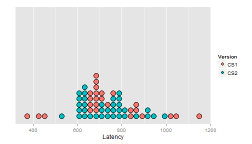

# Exploring the latency data

This `Rmd` file is where I try to figure out what's going on in the data.


```r
# Latency data
setwd("../")
source("R/01_functions.r", chdir = TRUE)
load("data/results.RData")
```


## Look at the untrimmed latency data

```r
PrintDescriptives <- function(results) {
    descriptives <- describeBy(results$Latency, group = results$Version, mat = T, 
        skew = F)
    rownames(descriptives) <- c("CS1", "CS2")
    # Convert to a dataframe for table-printing
    descriptives <- t(descriptives)[-c(1:3), ]
    descriptives <- as.data.frame(descriptives)
    print(ascii(descriptives), type = "pandoc")
}
PrintDescriptives(results)
```

          **CS1**   **CS2**  
--------- --------- ---------
n         397       644      
mean      755.0     754.3    
sd        457.6     485.5    
median    682.8     616.2    
trimmed   700.4     689.5    
mad       345.7     370.4    
min       66.62     66.62    
max       2498      2482     
range     2432      2415     
se        22.96     19.13    
--------- --------- ---------


These means are very close! Let's look at the histograms.


```r
qplot(data = results, x = Latency) + scale_x_continuous(breaks = (0:5 * 500)) + 
    facet_grid(Version ~ .)
```

```
## stat_bin: binwidth defaulted to range/30. Use 'binwidth = x' to adjust
## this.
```

```
## stat_bin: binwidth defaulted to range/30. Use 'binwidth = x' to adjust
## this.
```

 


Look at the number of NA latencies in each version of the experiment. There is probably a significant effect of group on the odds of obtaining a latency.


```r
results$NotNA <- ifelse(is.na(results$Latency), 0, 1)
not_na <- dcast(results, Version ~ NotNA, value.var = "NotNA")
names(not_na) <- c("Version", "Number NA Latencies", "Number Real Latencies")
print(ascii(not_na), type = "pandoc")
```

    **Version**   **Number NA Latencies**   **Number Real Latencies**  
--- ------------- ------------------------- ---------------------------
1   CS1           827.00                    397.00                     
2   CS2           376.00                    644.00                     
--- ------------- ------------------------- ---------------------------


## Trim off fast and slow latencies

Trim off the impossibly fast latencies (i.e., less than 250 ms.)


```r
results$TooFast <- round(results$Latency) < 250
# How many latencies were too fast within each group
too_fast <- dcast(results, Version ~ TooFast)
names(too_fast) <- c("Version", "Number > 250 ms", "Number < 250 ms", "Number NA")
print(ascii(too_fast), type = "pandoc")
```

    **Version**   **Number > 250 ms**   **Number < 250 ms**   **Number NA**  
--- ------------- --------------------- --------------------- ---------------
1   CS1           361.00                36.00                 827.00         
2   CS2           592.00                52.00                 376.00         
--- ------------- --------------------- --------------------- ---------------

```r
# Replace too fast of latencies with NA values
results$Latency[results$TooFast] <- NA
PrintDescriptives(results)
```

          **CS1**   **CS2**  
--------- --------- ---------
n         361       592      
mean      816.2     806.6    
sd        434.2     471.6    
median    716.1     666.2    
trimmed   748.8     734.0    
mad       321.0     395.1    
min       249.8     249.8    
max       2498      2482     
range     2248      2232     
se        22.85     19.38    
--------- --------- ---------


Trim off the exceptionally slow latencies.


```r
two_sd <- 2 * sd(results$Latency, na.rm = TRUE)
too_slow <- mean(results$Latency, na.rm = TRUE) + two_sd
num_too_slow <- length(which(results$Latency > too_slow))
num_non_NA <- length(which(!is.na(results$Latency)))
```


Reaction times slower than 1725 ms will be removed. There are 60 such trials, which is 6% of the data.


```r
results$Latency[results$Latency > too_slow] <- NA
PrintDescriptives(results)
```

          **CS1**   **CS2**  
--------- --------- ---------
n         340       553      
mean      736.8     721.4    
sd        298.0     353.4    
median    699.5     632.9    
trimmed   714.3     681.5    
mad       296.3     345.7    
min       249.8     249.8    
max       1682      1715     
range     1432      1466     
se        16.16     15.03    
--------- --------- ---------

```r
qplot(data = results, x = Latency) + scale_x_continuous(breaks = (0:5 * 500)) + 
    facet_grid(Version ~ .)
```

```
## stat_bin: binwidth defaulted to range/30. Use 'binwidth = x' to adjust
## this.
```

```
## stat_bin: binwidth defaulted to range/30. Use 'binwidth = x' to adjust
## this.
```

 


## Model the data

Aggregate reaction times by subject

```r
subject_means <- aggregate(Latency ~ Subject, results, mean)
merge_vars <- c("Subject", "EVT", "Version", "Age")
subject_means <- unique(merge(subject_means, results[merge_vars], by = "Subject"))
p <- ggplot(subject_means, aes(x = Latency, fill = Version)) + geom_dotplot(method = "histodot", 
    stackgroups = FALSE) + scale_y_continuous(name = "", breaks = NULL)
print(p)
```

```
## stat_bindot: binwidth defaulted to range/30. Use 'binwidth = x' to adjust
## this.
```

 


### Model the aggregated data


```r
m <- lm(Latency ~ Version + EVT + Age, subject_means)
print(ascii(summary(m)), type = "pandoc")
```

              **Estimate**   **Std. Error**   **t value**   **Pr(>|t|)**  
------------- -------------- ---------------- ------------- --------------
(Intercept)   812.62         90.99            8.93          0.00          
VersionCS2    -7.99          29.40            -0.27         0.79          
EVT           0.16           1.03             0.15          0.88          
Age           -2.04          2.52             -0.81         0.42          
------------- -------------- ---------------- ------------- --------------


```r
qplot(data = subject_means, x = EVT, y = Latency) + geom_smooth(method = "lm") + 
    labs(title = "By-Subject Reaction Times By EVT Raw Score")
```

```
## Warning: Removed 1 rows containing missing values (stat_smooth).
```

```
## Warning: Removed 1 rows containing missing values (geom_point).
```

 

```r
qplot(data = subject_means, x = Age, y = Latency) + geom_smooth(method = "lm") + 
    labs(title = "By-Subject Reaction Times By Age in Months")
```

```
## Warning: Removed 1 rows containing missing values (stat_smooth).
```

```
## Warning: Removed 1 rows containing missing values (geom_point).
```

 


### Check the model assumptions


```r
print(gvlma(m))
```

```
## 
## Call:
## lm(formula = Latency ~ Version + EVT + Age, data = subject_means)
## 
## Coefficients:
## (Intercept)   VersionCS2          EVT          Age  
##      812.62        -7.99         0.16        -2.04  
## 
## 
## ASSESSMENT OF THE LINEAR MODEL ASSUMPTIONS
## USING THE GLOBAL TEST ON 4 DEGREES-OF-FREEDOM:
## Level of Significance =  0.05 
## 
## Call:
##  gvlma(x = m) 
## 
##                       Value  p-value                   Decision
## Global Stat        19.13791 0.000738 Assumptions NOT satisfied!
## Skewness            1.47683 0.224271    Assumptions acceptable.
## Kurtosis            3.99656 0.045593 Assumptions NOT satisfied!
## Link Function       0.00376 0.951123    Assumptions acceptable.
## Heteroscedasticity 13.66077 0.000219 Assumptions NOT satisfied!
```


I need to find a transformation or a link function better suited for the distribution of these data.


