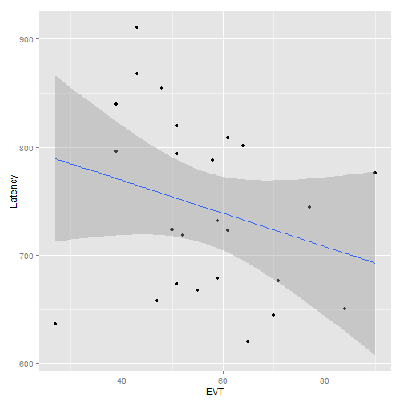
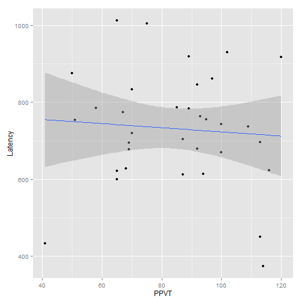

Exploring the latency data
==========================

This `Rmd` file is where I try to figure out what's going on in the data.

~~~~ {.r}
# Load the latency data
setwd("../")
source("R/01_functions.r", chdir = TRUE)
load("data/results.RData")

short <- unique(results[c("Version", "Subject", "Gender")])

ddply(results, ~Version + Subject, summarize, Counts = length(Gender))
ddpl
~~~~

    ## Error: object 'ddpl' not found

~~~~ {.r}
names(results)
~~~~

Reponses to JE's email:
-----------------------

### *For methods, can you write bullet points on how we calculated latencies?*

Reaction times measure the latency between looking to the distractor image and shifting the gaze towards the target image after the onset of the target word. The following conditions were required for the latency calculation:

-   During the first 50 ms of the target word, the child had to be looking onscreen, but not at the target image.
-   The first look to the target must occur afte 250r ms. (That is, shifts of looks towards the target before 250 ms were considered too fast to be deliberate responses to the target word.)

### *After trimming, what % of trials had latencies in CS1? In CS2? Are there more trials with latencies in CS2 compared to CS1 after trimming, as there were before trimming?*

Here are the summary stats for the unadjusted values. First, we remove subjects who have been designated as non-keepers. We also remove subjects who were tested with the AAE dialect stimuli, since those audio stimuli were not the same duration.

~~~~ {.r}
results <- subset(results, is.na(Keeper) & Dialect == "SAE")
PrintDescriptives(results)
~~~~

||**CS1**|**CS2**|
|---|:------|:------|
|n|340|979|
|mean|686.4|775.8|
|sd|430.4|516.7|
|median|599.6|616.2|
|trimmed|635.6|701.7|
|mad|321.0|395.1|
|min|66.62|66.62|
|max|2498|2482|
|range|2432|2415|
|se|23.34|16.51|

~~~~ {.r}
ComputePercentNA(results)
~~~~

    ## Error: could not find function "ComputePercentNA"

Table: Response rates for the experiment versions, before trimming.

Now we trim of the too-fast values using 250 ms as the cut-off.

~~~~ {.r}
results <- TrimTooFast(results, cutoff = 250)
~~~~

|**Version**|**Num \> 250 ms**|**Num \<= 250 ms**|**Num NA**|
|:----------|:----------------|:-----------------|:---------|
|CS1|298|42|620|
|CS2|905|74|585|

The upper-bound of the trimming depends on what pool of latencies are used to compute the standard deviation used for the 2-SD cut-off.

~~~~ {.r}
ComputeUpperBound <- function(x) mean(x, na.rm = T) + (2 * sd(x, na.rm = T))
DropAboveUpperBound <- function(df) {
    cutoff <- ComputeUpperBound(df$Latency)
    df$Latency[df$Latency > cutoff] <- NA
    df
}

# Pooling both experiments together
ComputeUpperBound(results$Latency)
~~~~

    ## [1] 1774

~~~~ {.r}
# Separating the two experiments
by(results$Latency, results$Version, ComputeUpperBound)
~~~~

    ## results$Version: CS1
    ## [1] 1570
    ## -------------------------------------------------------- 
    ## results$Version: CS2
    ## [1] 1834

~~~~ {.r}
cs1 <- subset(results, Version == "CS1")
cs1 <- DropAboveUpperBound(cs1)
cs2 <- subset(results, Version == "CS2")
cs2 <- DropAboveUpperBound(cs2)
results <- rbind(cs1, cs2)
~~~~

~~~~ {.r}
PrintDescriptives(results)
~~~~

||**CS1**|**CS2**|
|---|:------|:------|
|n|283|853|
|mean|679.2|732.2|
|sd|261.8|374.5|
|median|632.9|616.2|
|trimmed|660.4|688.6|
|mad|271.6|345.7|
|min|249.8|249.8|
|max|1482|1815|
|range|1232|1566|
|se|15.56|12.82|

~~~~ {.r}
ComputePercentNA(results)
~~~~

    ## Error: could not find function "ComputePercentNA"

Table: Response rates for the experiment versions, after trimming.

### *After trimming, is the average latency shorter for CS2 as compared to CS1? (as it was before trimming)?*

Yes.

### *Is there a relationship between vocab size (either EVT-2 raw score of PPVT-4 raw score) and latency for CS1?*

I'm going to compute the average latency within each subject and plot latency as a function of EVT and PPVT.

~~~~ {.r}
subject_means <- ddply(results, "Subject", summarize, Version = unique(Version), 
    EVT = unique(EVT), PPVT = unique(PPVT), Latency = mean(Latency, na.rm = TRUE))
cs1 <- subset(subject_means, Version == "CS1")
# EVT
qplot(data = cs1, x = EVT, y = Latency) + geom_smooth(method = "lm")
~~~~

~~~~ {.r}
# PPVT
qplot(data = cs1, x = PPVT, y = Latency) + geom_smooth(method = "lm")
~~~~

### *Same question for CS2?*

For the aggregated values, there is some correlation between EVT and latency.

~~~~ {.r}
cs2 <- subset(subject_means, Version == "CS2")
# EVT
qplot(data = cs2, x = EVT, y = Latency) + geom_smooth(method = "lm")
~~~~

~~~~ {.r}
# PPVT
qplot(data = cs2, x = PPVT, y = Latency) + geom_smooth(method = "lm")
~~~~

~~~~ {.r}
summary(lm(Latency ~ EVT, cs2))
~~~~

    ## 
    ## Call:
    ## lm(formula = Latency ~ EVT, data = cs2)
    ## 
    ## Residuals:
    ##     Min      1Q  Median      3Q     Max 
    ## -153.32  -61.70   -8.25   68.39  145.50 
    ## 
    ## Coefficients:
    ##             Estimate Std. Error t value Pr(>|t|)    
    ## (Intercept)   830.99      65.96   12.60  8.3e-12 ***
    ## EVT            -1.54       1.13   -1.36     0.19    
    ## ---
    ## Signif. codes:  0 '***' 0.001 '**' 0.01 '*' 0.05 '.' 0.1 ' ' 1
    ## 
    ## Residual standard error: 80.2 on 23 degrees of freedom
    ## Multiple R-squared:  0.0743, Adjusted R-squared:  0.0341 
    ## F-statistic: 1.85 on 1 and 23 DF,  p-value: 0.187
