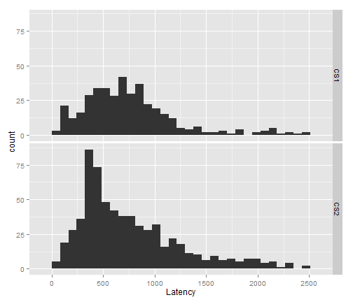

<!--pandoc
  s: 
  mathjax: 
  format: html5
  o: exploring-out.html
  
  format: markdown_github
  o: exploring-out.md
-->

## Get the data ready

Load the trial-by-trial data.


```r
setwd("../")
source("01_functions.r", chdir = TRUE)
load("data/clean.RData")
within_ms <- 50
```


### Compute the latencies. 

Within the first 50 ms of target-onset, the subject must be:

* Not looking to the target word
* Looking on the screen


```r
onset_window <- DefineOnsetWindow(starting_time = 0, window_duration = within_ms)
CalculateRealLatency <- MakeLatencyCalculator(onset_window, "Target")
results <- ddply(clean, ~Subject + TrialNo, CalculateRealLatency)
# Combine two versions of Cross-sectional2 into same grouping factor
results$Version <- factor(ifelse(results$Group == "CS1", "CS1", "CS2"))
```


## Look at the raw latency data


```r
descriptives <- describeBy(results$Latency, group = results$Version, mat = T, 
    skew = F)
rownames(descriptives) <- c("CS1", "CS2")
# Convert to a dataframe for table-printing
descriptives <- t(descriptives)[-c(1:3), ]
descriptives <- as.data.frame(descriptives)
print(ascii(descriptives), type = "pandoc")
```

          **CS1**   **CS2**  
--------- --------- ---------
n         397       644      
mean      755.0     754.3    
sd        457.6     485.5    
median    682.8     616.2    
trimmed   700.4     689.5    
mad       345.7     370.4    
min       66.62     66.62    
max       2498      2482     
range     2432      2415     
se        22.96     19.13    
--------- --------- ---------


*** 

## Scratch area for testing things out

**Ciations**

* @BaayenRTs recommend blah blah blah.
* We try the inverse-normal distribution [@BaayenRTs],

**Embed an image!**


```r
plot(cars)
```

 


**Tables?**

Use the `ascii` package to make a captioned Pandoc table:


```r
library(ascii)
data(esoph)
print(ascii(esoph[1:10, ]), type = "pandoc")
```

     **agegp**   **alcgp**   **tobgp**   **ncases**   **ncontrols**  
---- ----------- ----------- ----------- ------------ ---------------
1    25-34       0-39g/day   0-9g/day    0.00         40.00          
2    25-34       0-39g/day   10-19       0.00         10.00          
3    25-34       0-39g/day   20-29       0.00         6.00           
4    25-34       0-39g/day   30+         0.00         5.00           
5    25-34       40-79       0-9g/day    0.00         27.00          
6    25-34       40-79       10-19       0.00         7.00           
7    25-34       40-79       20-29       0.00         4.00           
8    25-34       40-79       30+         0.00         7.00           
9    25-34       80-119      0-9g/day    0.00         2.00           
10   25-34       80-119      10-19       0.00         1.00           
---- ----------- ----------- ----------- ------------ ---------------

Table: This is a table caption.

## References
