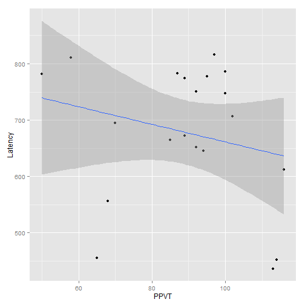
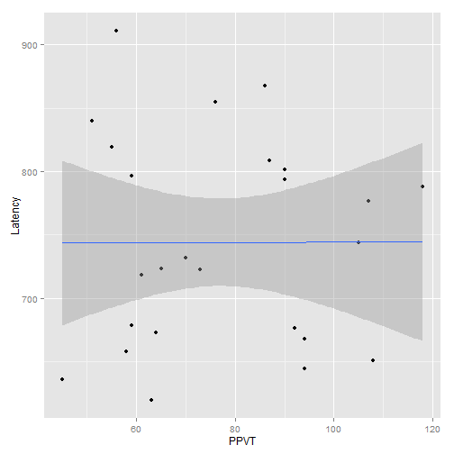

# Exploring the latency data

This `Rmd` file is where I try to figure out what's going on in the data.


```r
# Load the latency data
setwd("../")
source("R/01_functions.r", chdir = TRUE)
load("data/results.RData")
```


## Reponses to JE's email:

### _For methods, can you write bullet points on how we calculated latencies?_

Reaction times measure the latency between looking to the distractor image and shifting the gaze towards the target image after the onset of the target word. The following conditions were required for the latency calculation:

* During the first 50 ms of the target word, the child had to be looking onscreen, but not at the target image.
* The first look to the target must occur afte 250r ms. (That is, shifts of looks towards the target before 250 ms were considered too fast to be deliberate responses to the target word.)


### _After trimming, what % of trials had latencies in CS1? In CS2? Are there more trials with latencies in CS2 compared to CS1 after trimming, as there were before trimming?_

Here are the summary stats for the unadjusted values.


Table: Descriptives for unadjusted latency values


3. After trimming, is the average latency shorter for CS2 as compared to CS1? (as it was before trimming)?

4. Is there a relationship between vocab size (either EVT-2 raw score of PPVT-4 raw score) and latency for CS1?
5. Same question for CS2?

6. I like your idea of modeling the odds of getting a latency onto group (CS1 vs CS2), age, and vocab size.

Even without 6, though, I think we have enough for a poster. However, if the answer to 4 is no, it's not very interesting since previous research has shown a relationship between vocabulary size and latency. If the answer to 4 is no, maybe we should do the same analysis for looking to nonwords and see what you get. Why don't \I work on the plane tomorrow on putting the poster together in terms of the intro and methods (up to calculating latency) and you continue to work on the analyses? Does this seem like a good division of labor? If we don't have a "yes" answer for 4, let's go ahead and do the same analysis for looking to the unfamiliar object for the nonword trials and see what we get for 2, 3, 4, & 5 above.

Yours,
Jan


## Look at the untrimmed latency data


### Remove nonkeepers

We remove subject who have been designated as non-keepers. We also remove
subjects who were tested with the AAE dialect stimuli, since those audio
stimuli were not the same duration.


```r
results <- subset(results, is.na(Keeper) & Dialect == "SAE")
PrintDescriptives(results)
```

```
## 
##           **CS1**   **CS2**  
## --------- --------- ---------
## n         285       579      
## mean      756.8     752.1    
## sd        451.1     484.7    
## median    699.5     616.2    
## trimmed   702.5     687.8    
## mad       345.7     370.4    
## min       66.62     66.62    
## max       2498      2482     
## range     2432      2415     
## se        26.72     20.14    
## --------- --------- ---------
```

Table: Descriptives after excluding some subjects

These means are very close! Let's look at the histograms.


```r
qplot(data = results, x = Latency) + scale_x_continuous(breaks = (0:5 * 500)) + 
    facet_grid(Version ~ .)
```

```
## stat_bin: binwidth defaulted to range/30. Use 'binwidth = x' to adjust
## this.
```

```
## stat_bin: binwidth defaulted to range/30. Use 'binwidth = x' to adjust
## this.
```

 


Examine the number of NA latencies in each version of the experiment. There is
probably a significant effect of group on the odds of obtaining a latency.


```r
ComputePercentNA(results)
```

```
## Aggregation function missing: defaulting to length
```

    **Version**   **NA Latencies**   **Real Latencies**   **Percent NA**  
--- ------------- ------------------ -------------------- ----------------
1   CS1           567.00             285.00               66.55           
2   CS2           345.00             579.00               37.34           
--- ------------- ------------------ -------------------- ----------------

Table: Number and Percentage of Miss vs Realized Latencies per experiment


## Trim off fast and slow latencies


### Trim off the impossibly fast latencies (i.e., less than 250 ms.)


```r
results <- TrimTooFast(results, cutoff = 250)
```

    **Version**   **Num > 250 ms**   **Num < 250 ms**   **Num NA**  
--- ------------- ------------------ ------------------ ------------
1   CS1           259.00             26.00              567.00      
2   CS2           531.00             48.00              345.00      
--- ------------- ------------------ ------------------ ------------

```r
PrintDescriptives(results)
```

          **CS1**   **CS2**  
--------- --------- ---------
n         259       531      
mean      817.3     805.8    
sd        428.2     470.1    
median    716.1     666.2    
trimmed   752.1     732.7    
mad       296.3     395.1    
min       249.8     249.8    
max       2498      2482     
range     2248      2232     
se        26.61     20.40    
--------- --------- ---------


### Trim off the exceptionally slow latencies.


```r
results <- TrimTooSlow(results, sd_cutoff = 2)
```

```
## Using TooSlow as value column: use value.var to override.
```

```
## Aggregation function missing: defaulting to length
```

    **Version**   **Num < 1723 ms**   **Num > 1723 ms**   **Num NA**  
--- ------------- ------------------- ------------------- ------------
1   CS1           243.00              16.00               593.00      
2   CS2           496.00              35.00               393.00      
--- ------------- ------------------- ------------------- ------------

```r
PrintDescriptives(results)
```

          **CS1**   **CS2**  
--------- --------- ---------
n         227       458      
mean      819.6     813.4    
sd        423       473      
median    732.8     666.2    
trimmed   756.9     739.6    
mad       321.0     395.1    
min       249.8     249.8    
max       2365      2482     
range     2115      2232     
se        28.08     22.10    
--------- --------- ---------


Reaction times slower than 1722.7219 ms will be removed. There are


```

Error in eval(expr, envir, enclos) : object 'TrimmedSlow' not found

```

 such trials.


## Transform the data


```r
qplot(data = results, x = Latency) + facet_grid(Version ~ .) + labs(title = "Trimmed Latencies")
```

```
## stat_bin: binwidth defaulted to range/30. Use 'binwidth = x' to adjust
## this.
```

```
## stat_bin: binwidth defaulted to range/30. Use 'binwidth = x' to adjust
## this.
```

 

```r
qplot(data = results, x = 1/Latency) + facet_grid(Version ~ .) + labs(title = "Reciprocal-transformed, trimmed Latencies")
```

```
## stat_bin: binwidth defaulted to range/30. Use 'binwidth = x' to adjust
## this.
```

```
## stat_bin: binwidth defaulted to range/30. Use 'binwidth = x' to adjust
## this.
```

 

```r
qplot(data = results, x = log(Latency)) + facet_grid(Version ~ .) + labs(title = "Log-transformed, trimmed Latencies")
```

```
## stat_bin: binwidth defaulted to range/30. Use 'binwidth = x' to adjust
## this.
```

```
## stat_bin: binwidth defaulted to range/30. Use 'binwidth = x' to adjust
## this.
```

 


```r
results$LogLatency <- log(results$Latency)
results$Rate <- 1/results$Latency

m <- lm(Rate ~ EVT, data = results)
summary(m)
```

```
## 
## Call:
## lm(formula = Rate ~ EVT, data = results)
## 
## Residuals:
##       Min        1Q    Median        3Q       Max 
## -0.001197 -0.000613 -0.000161  0.000488  0.002421 
## 
## Coefficients:
##             Estimate Std. Error t value Pr(>|t|)    
## (Intercept) 1.56e-03   1.43e-04   10.92   <2e-16 ***
## EVT         6.69e-07   2.38e-06    0.28     0.78    
## ---
## Signif. codes:  0 '***' 0.001 '**' 0.01 '*' 0.05 '.' 0.1 ' ' 1
## 
## Residual standard error: 0.000787 on 683 degrees of freedom
##   (1091 observations deleted due to missingness)
## Multiple R-squared:  0.000115,	Adjusted R-squared:  -0.00135 
## F-statistic: 0.0787 on 1 and 683 DF,  p-value: 0.779
```

```r
gvlma(m)
```

```
## 
## Call:
## lm(formula = Rate ~ EVT, data = results)
## 
## Coefficients:
## (Intercept)          EVT  
##    1.56e-03     6.69e-07  
## 
## 
## ASSESSMENT OF THE LINEAR MODEL ASSUMPTIONS
## USING THE GLOBAL TEST ON 4 DEGREES-OF-FREEDOM:
## Level of Significance =  0.05 
## 
## Call:
##  gvlma(x = m) 
## 
##                      Value  p-value                   Decision
## Global Stat        63.9242 4.34e-13 Assumptions NOT satisfied!
## Skewness           62.6408 2.44e-15 Assumptions NOT satisfied!
## Kurtosis            0.0180 8.93e-01    Assumptions acceptable.
## Link Function       0.0872 7.68e-01    Assumptions acceptable.
## Heteroscedasticity  1.1782 2.78e-01    Assumptions acceptable.
```

```r
plot(m, which = 2)
```

 

```r

m <- lm(LogLatency ~ EVT, data = results)
summary(m)
```

```
## 
## Call:
## lm(formula = LogLatency ~ EVT, data = results)
## 
## Residuals:
##     Min      1Q  Median      3Q     Max 
## -1.0605 -0.4005 -0.0215  0.3588  1.2541 
## 
## Coefficients:
##              Estimate Std. Error t value Pr(>|t|)    
## (Intercept)  6.608499   0.093700   70.53   <2e-16 ***
## EVT         -0.000718   0.001566   -0.46     0.65    
## ---
## Signif. codes:  0 '***' 0.001 '**' 0.01 '*' 0.05 '.' 0.1 ' ' 1
## 
## Residual standard error: 0.517 on 683 degrees of freedom
##   (1091 observations deleted due to missingness)
## Multiple R-squared:  0.000308,	Adjusted R-squared:  -0.00116 
## F-statistic: 0.21 on 1 and 683 DF,  p-value: 0.647
```

```r
gvlma(m)
```

```
## 
## Call:
## lm(formula = LogLatency ~ EVT, data = results)
## 
## Coefficients:
## (Intercept)          EVT  
##    6.608499    -0.000718  
## 
## 
## ASSESSMENT OF THE LINEAR MODEL ASSUMPTIONS
## USING THE GLOBAL TEST ON 4 DEGREES-OF-FREEDOM:
## Level of Significance =  0.05 
## 
## Call:
##  gvlma(x = m) 
## 
##                     Value p-value                   Decision
## Global Stat        18.260 0.00110 Assumptions NOT satisfied!
## Skewness            7.178 0.00738 Assumptions NOT satisfied!
## Kurtosis            9.169 0.00246 Assumptions NOT satisfied!
## Link Function       0.344 0.55757    Assumptions acceptable.
## Heteroscedasticity  1.568 0.21044    Assumptions acceptable.
```

```r
plot(m, which = 2)
```

 


```r
lmer(Rate ~ Version + (1 | Subject), results)
```

```
## Linear mixed model fit by REML 
## Formula: Rate ~ Version + (1 | Subject) 
##    Data: results 
##    AIC   BIC logLik deviance REMLdev
##  -7807 -7789   3908    -7852   -7815
## Random effects:
##  Groups   Name        Variance Std.Dev.
##  Subject  (Intercept) 4.98e-16 2.23e-08
##  Residual             6.18e-07 7.86e-04
## Number of obs: 685, groups: Subject, 67
## 
## Fixed effects:
##             Estimate Std. Error t value
## (Intercept) 1.53e-03   5.22e-05    29.3
## VersionCS2  1.02e-04   6.38e-05     1.6
## 
## Correlation of Fixed Effects:
##            (Intr)
## VersionCS2 -0.818
```


## Model the data


Aggregate reaction times by subject


```r
# subject_means <- aggregate(Latency ~ Subject, results, mean) merge_vars
# <- c('Subject', 'EVT', 'Version', 'Age') subject_means <-
# unique(merge(subject_means, results[merge_vars], by='Subject'))
# 
# p <- ggplot(subject_means, aes(x = Latency, fill = Version)) +
# geom_dotplot(method='histodot', stackgroups=FALSE) print(p)
```


### Model the aggregated data


```r
m <- lm(Latency ~ Version + EVT + Age, subject_means)
```

```
## Error: object 'subject_means' not found
```

```r
m_tab <- ascii(m)
names(m_tab$x)[4] <- "Pr(>t)"
print(m_tab, type = "pandoc")
```

              **Estimate**   **Std. Error**   **t value**   **Pr(>t)**  
------------- -------------- ---------------- ------------- ------------
(Intercept)   6.61           0.09             70.53         0.00        
EVT           -0.00          0.00             -0.46         0.65        
------------- -------------- ---------------- ------------- ------------


```r
qplot(data = subject_means, x = EVT, y = Latency) + geom_smooth(method = "lm") + 
    labs(title = "By-Subject Reaction Times By EVT Raw Score")
```

```
## Error: object 'subject_means' not found
```

```r
qplot(data = subject_means, x = Age, y = Latency) + geom_smooth(method = "lm") + 
    labs(title = "By-Subject Reaction Times By Age in Months")
```

```
## Error: object 'subject_means' not found
```


### Check the model assumptions


```r
print(gvlma(m))
```

```
## 
## Call:
## lm(formula = LogLatency ~ EVT, data = results)
## 
## Coefficients:
## (Intercept)          EVT  
##    6.608499    -0.000718  
## 
## 
## ASSESSMENT OF THE LINEAR MODEL ASSUMPTIONS
## USING THE GLOBAL TEST ON 4 DEGREES-OF-FREEDOM:
## Level of Significance =  0.05 
## 
## Call:
##  gvlma(x = m) 
## 
##                     Value p-value                   Decision
## Global Stat        18.260 0.00110 Assumptions NOT satisfied!
## Skewness            7.178 0.00738 Assumptions NOT satisfied!
## Kurtosis            9.169 0.00246 Assumptions NOT satisfied!
## Link Function       0.344 0.55757    Assumptions acceptable.
## Heteroscedasticity  1.568 0.21044    Assumptions acceptable.
```


I need to find a transformation or a link function better suited for the distribution of these data.


# Does Trial Number (fatigue) predict latency?

Yes, there is a significant effect of Trial Number on Latency. It's a very small effect.


```r
qplot(data = results, x = Trial, y = Latency) + geom_smooth(method = "lm")
```

 

```r
m2 <- lm(data = results, Latency ~ Trial + Version + EVT + Age)
m_tab <- ascii(m2)
names(m_tab$x)[4] <- "Pr(>t)"
print(m_tab, type = "pandoc")
```

              **Estimate**   **Std. Error**   **t value**   **Pr(>t)**  
------------- -------------- ---------------- ------------- ------------
(Intercept)   853.10         131.41           6.49          0.00        
Trial         2.64           1.69             1.56          0.12        
VersionCS2    -13.52         39.28            -0.34         0.73        
EVT           -0.62          1.77             -0.35         0.73        
Age           -0.87          4.08             -0.21         0.83        
------------- -------------- ---------------- ------------- ------------


