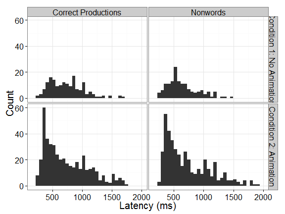

# Do orienting stimuli create additional task demands in the looking-while-listening paradigm?

## Introduction
The looking-while-listening paradigm [LWL; @FernaldLWL] uses eye-tracking to study lexical comprehension in young children. In this procedure, two images are presented on a computer screen followed by a prompt to look at one of the images. The data gathered through eye-tracking not only records _where_ the child looks onscreen but _when_ the child fixates on a particular image. The latency between the onset of a speech stimulus and an appropriate change of gaze location provides a measure of how rapidly the child accesses the word's lexical representation. Reaction time is related to vocabulary size in young children and is also predictive of later language abilities [@FernaldHalfAWord; @MarchmanLangOutcomes]. 

Reaction times provide valuable information about the real-time processing of speech signal in children, but these data are not easily obtained. In a 2-alternative forced choice (2AFC) LWL paradigm, there is a 50% chance the child will be fixated on the target image at onset of the speech stimulus, so only half the trials will provide latency data. This problem is readily resolved in studies with adults by instructing participants to fixate on a central orienting image until they hear the stimulus. Unfortunately, young children cannot be similarly instructed.

In this study, we modified the LWL paradigm to include an animated centering stimulus in order to increase the number of trials with meaningful reaction time data. We hypothesized that the orienting animations will increase the "quality" of the eye-tracking data but may also introduce additional task demands that hinder response time and reduce accuracy. 


*** 


@BaayenRTs recommend blah blah blah.

We try the inverse-normal distribution [@BaayenRTs],

You can also embed plots, for example:


```r
plot(cars)
```

 


## References


