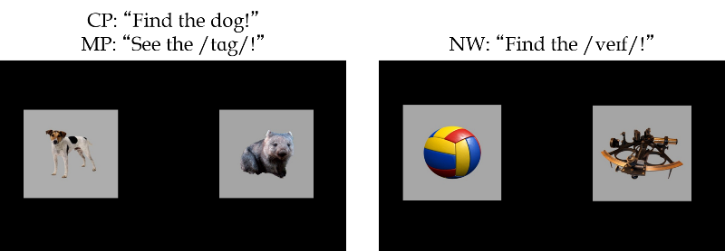

# Do orienting stimuli create additional task demands in the looking-while-listening paradigm? 

_Tristan Mahr and Jan Edwards_


## Introduction and Rationale

* The 2AFC looking-while-listening paradigm [LWL; @FernaldLWL] has become widely used to examine lexical processing in young children.
* The speed at which children look to familiar objects when hearing the object-name at 18 months reliably predicts vocabulary size up to 8 years of age [@MarchmanLangOutcomes].  
    - However, these reaction time measures are not easily obtained.
    - Reaction time provides a measure of how quickly a child looks to a picture when its object name is presented.  Therefore, reaction time can be measured only on trials where the child is _not_ looking at the target picture at the onset of the target word.
    - In a 2AFC paradigm, only about 50% of trials provide reaction time data. 
    - Usually, even fewer trials provide reaction time data because there are always some trials where young children are not fixating on a picture at target word onset.
    - This is a considerable problem, given the small number of trials in LWL studies (usually between 24 and 36).
* Adults can be instructed to fixate on a central orienting stimuli, but young children cannot be similarly instructed.
* This study used an animated centering stimulus in an attempt to increase the number of LWL trials with useable reaction times.


## METHOD

### Conditions

Condition 1: No animated centering stimulus.

Condition 2: Animated centering stimulus.

* Centering stimulus was an abstract geometric animation. It appeared onscreen after two images had been presented for 2000\ ms. 
* The animation looped until the child had fixated on it for 300\ ms or until 8000\ ms had elapsed. Then the carrier phrase (_find the_) was played; at target-word onset, the centering stimulus disappeared.
* Because carrier phrase and target-word presentation were triggered by fixation to the animation, these trials incorporated _gaze-contingency_ into the LWL paradigm.

```{r Preparation, results='hide', message=FALSE, warning=FALSE, echo = FALSE}
# Load the latency data
setwd("../")
source('R/01_functions.r', chdir = TRUE)
load("data/results.RData")
# Disable echos, messages, and warnings
opts_chunk$set(echo = FALSE, message = FALSE, warning = FALSE)
```

```{r Gender Counts}
genders <- ddply(results, ~ Subject + Gender + Version, 
                 summarize, Subject = unique(Subject))
genders <- xtabs(~ Gender + Version, genders)
```


### Participants

* N\ =\ `r sum(genders[, "CS1"])` (`r genders["F", "CS1"]` female, `r genders["M", "CS1"]` male) in condition 1 and N\ =\ `r sum(genders[, "CS2"])` (`r genders["F", "CS2"]` female, `r genders["M", "CS2"]` male) in condition 2.
* Participants in the two groups closely matched on the basis of age, sex, and PPVT-4 standard score.

```{r Test Scores, results = 'asis'}
# Aggregate means and ranges
scores <- ddply(results, ~ Subject + Age + EVT_Standard + PPVT_Standard + Version, summarize, 
                Subject = unique(Subject))
scores <- melt(scores, id.vars=c("Subject", "Version"))
scores <- dcast(scores, Version ~ variable, DisplayMeanRange)
# Prep table
names(scores) <- c("&nbsp;", "Age (months)", "EVT-2 standard score", "PPVT-4 standard score")
# Overwrite with standard scores
scores[, 3] <- c("129.8 (111--149)", "122.5 (92--146)")
PrettyPrint(scores, include.rownames = FALSE)
```


### Methodology

* Looking-while-listening mispronunciation paradigm [@SwingleyMP; @WhiteSubsegmental]
* Experiment designed in E-Prime Professional 2.0, used to interface with Tobii T60 XL Eye-tracker.
* Eye-tracking task presented to children as “watching a movie.”
* Images presented onscreen: one familiar and one unfamiliar object.
* Position counterbalanced (left-right).
* Images normed for familiarity and unfamiliarity.


#### Three conditions

1. CP: Correct pronunciation of real words
2. MP: Mispronunciations of these real words, with a one-feature change of initial consonant
3. NW: Nonwords trials presented with familiar objects not used in CP trials

* Target words all CVC in the carrier phrases "See the \_\_\_\_!" or "Find the \_\_\_\_!"
* (6\ CP\ +\ 6\ MP\ +\ 6\ NW)\ *\ 2 repetitions\ +\ 2 other real-word familiarization trials\ =\ 38 trials
* 2 blocks of 38 trials, eye-tracker calibrated before each block.
* Brief animation played every 6--7 trials to keep child engaged in task. 




### Calculation of Latency (reaction time)

* Latency is the amount of time between target-word onset and the first look to target.
* Latency calculated for CP and NW trials only. 
* On each trial, reaction time was calculated only if:
    1. the child looked onscreen within the 50\ ms after target-word onset
    2. the child was not already looking at familiar object (CP trials) or at unfamiliar object (NW trials) during within 50\ ms after target-word onset.
* Latency\ =\ Time of first look to target\ &#8722;\ time of first tracked look during target-word onset (0 to 50\ ms)
* Reaction time trimming: We excluded latencies that were less than 250\ ms or greater than 2SD above the group mean.


### Research Questions

* Does the use of an animated centering stimulus result in more useable latencies?
    - That is, are there more trials with useable latencies in condition 2 as compared to condition 1?
* Does this animated centering stimulus create additional task demands? 
    - Do children take longer to look to the target in condition 2 relative to condition 1?
    - Does the relationship between reaction time and vocabulary size reported in the literature continue to be observed when an animated centering stimulus is used?


## RESULTS

As expected, children looked to familiar object in CP trials and to unfamiliar object in NW trials.

### Latency Results

```{r Compute Percentages, results='hide'}
# Compute percentage captured
original <- ddply(results, ~ Version + Condition, summarize, 
                  Percent = 100 - CalculatePercentNA(Latency))
results <- TrimTooFast(results, cutoff = 250)
results <- TrimByGroup(results, group = ~ Version + Condition)
trimmed <- ddply(results, ~ Version + Condition, summarize, 
                 Percent = 100 - CalculatePercentNA(Latency))
# Prep variables for reference
labels <- paste0(original$Version, "_", original$Condition)
originals <- as.list(round(original$Percent, 1))
names(originals) <- labels
trims <- as.list(round(original$Percent - trimmed$Percent, 1))
names(trims) <- labels
```

* Condition 1:
    - CP trials: Latencies available in `r originals$CS1_real`% of trials (additional `r trims$CS1_real`% trimmed)
    - NW trials: Latencies available in `r originals$CS1_nonsense`% of trials (additional `r trims$CS1_nonsense`% trimmed)
* Condition 2:
    - CP trials: Latencies available in `r originals$CS2_real`% of trials (additional `r trims$CS2_real`% trimmed)
    - NW trials: Latencies available in `r originals$CS2_nonsense`% of trials (additional `r trims$CS2_nonsense`% trimmed)
* Mean latencies are very similar across the two conditions and the two trial types.
* Distributions of latencies differs across the two conditions, with condition 2 (with the centering stimuli) having a more peaky and positively skewed distribution.

```{r Mean Latencies, results='asis'}
means <- aggregate(Latency ~ Version + Condition, data = results, mean_sd)
means$Condition <- ifelse(means$Condition == "real", "Correct Productions (ms)", "Nonwords (ms)")
means_table <- dcast(means, Version ~ Condition)
names(means_table)[1] <- "&nbsp;"
PrettyPrint(means_table, include.rownames = FALSE)
```

```{r Histograms, fig.height=6, fig.width=8, fig.cap="Figure 3. Histograms of latencies (ms) for condition 1 (top) and condition 2 (bottom) for CP trials (left) and NW trials (right)."}
results2 <- mutate(results, Ver = ifelse(Version == "CS1", "Condition 1: No Animation", "Condition 2: Animation"),
                   Stim = ifelse(Condition == "real", "Correct Productions", "Nonwords"))
qplot(data = results2, x = Latency) + facet_grid(Ver ~ Stim) + 
  theme_bw() + labs(x = "Latency (ms)", y = "Count")+
  theme(text = element_text(size = 20))
```


### Regression analyses

* Do age, expressive vocabulary size or trial type predict latency in either conditions?
* We ran two separate multiple regression analyses, one for each condition. The dependent variable was the mean latencies for each subject for each trial type (CP or NW).
* Independent variables were age, trial type (CP or NW), and EVT-2 raw score (expressive vocabulary size).
* The regression results were also checked against a mixed effects model that used by-subject random intercepts and random slopes for trial type rather than aggregating latencies into subject means.

```{r Aggregated Mean Models, results="hide"}
# Aggregate on subject means within each condition
subject_means <- aggregate(Latency ~ Subject + Age + EVT + Version + Condition, 
                           data = results, Average)
# Subset by experimental version
subject_means <- mutate(subject_means, Condition = ifelse(Condition == "real", "CP", "NW"))
cs1 <- subset(subject_means, Version == "CS1")
cs2 <- subset(subject_means, Version == "CS2")
m1 <- lm(Latency ~ EVT + Age + Condition, cs1)
m2 <- lm(Latency ~ EVT + Age + Condition, cs2)
```

```{r lmer Model, eval=FALSE}
# Optional within subjects model
cs1_full <- subset(results, Version == "CS1")
cs2_full <- subset(results, Version == "CS2")
m <- lmer(Latency ~ EVT + Age + Condition + (Condition|Subject), cs1_full)
Anova(m, type = 3, test = "F")
m <- lmer(Latency ~ EVT + Age + Condition + (Condition|Subject), cs2_full)
Anova(m, type = 3, test = "F")
```

```{r Model_Plots, fig.height=5, fig.width=8, fig.cap="Figure 4. Relationship between EVT-2 and mean latencies for each subject by condition and trial"}
plotter <- mutate(subject_means, 
                  Trial = ifelse(Condition == "CP", "Correct Production", "Nonword"), 
                  Version = ifelse(Version == "CS1", "Condition 1", "Condition 2"))
ggplot(data = plotter, aes(x = EVT, y = Latency, color = Trial)) + 
  geom_point(size = 2.5) + facet_grid(~Version) + 
  geom_smooth(method = "lm", level = .68) + theme_bw() + 
  labs(x = "EVT-2", y = "Mean Latency (ms)", color = "Trial Type") + 
  theme(legend.position = "bottom", text = element_text(size = 20)) + 
  scale_colour_brewer(palette="Set1")
```


#### Regression Results:  Condition 1

* Age, trial type, and EVT-2 were significant predictors of latency, _R_^2\ =\ `r PrintR2(m1)`, _F_`r PrintFDfs(m1)`, _p_\ =\ `r PrintFp(m1, 3)`.

```{r Model_1_Results, results = 'asis'}
cols <- c("**Estimate**", "**Std. Error**", "**_t_**", "**_p_**")
rows <- c("Intercept", "EVT", "Age", "Condition")
PrettyPrint(summary(m1), rownames = rows, colnames = cols, header = FALSE)
```

#### Regression Results: Condition 2

* None of the independent variables were significant predictors of latency, _R_^2\ =\ `r PrintR2(m2)`, _F_`r PrintFDfs(m2)`, _p_\ =\ `r PrintFp(m2, 3)`.

```{r Model 2 results, results = 'asis'}
PrettyPrint(summary(m2), rownames = rows, colnames = cols, header = FALSE)
```


## Discussion

```{r Compute Overall Percents}
percents <- ddply(results, ~ Version, summarize, Percent = 100 - CalculatePercentNA(Latency))
percents <- structure(as.list(percents$Percent), names = as.character(percents$Version))
```

* These results suggest that using an animated centering stimulus will yield more useable latency data.
    - About `r percents$CS2`% of trials had useable latencies when an animated centering stimulus was used, compared to `r percents$CS1`% when it was not used.
* The fact that reaction times were not significantly different across the two conditions suggests that the animated centering stimulus does not create additional task demands.
* As in previous research, vocabulary size was a significant predictor of latency in condition 1 without the animated centering stimulus
* This result suggests that the effect of age and vocabulary size on latency in this study may have been due, at least in part, to older children and children with larger vocabularies having better attention to task. When an animated centering stimulus was used to maintain attention, the effect of age and vocabulary size on latency was no longer observed.
* This study examined the relationship between latency and vocabulary size in 30--48 month-old children. More research is needed to evaluate whether this relationship continues to be observed in younger children when an animated centering stimulus is used to maintain attention.
* To conclude, the use of an animated centering stimulus does not create additional task demands. Instead, it results in more useable latency data and better attention to task.


### Acknowledgements

Thanks to Franzo Law II, Alissa Schneeberg, Danielle Lee, David Kaplan, Morgan Meredith, Erica Richmond, Nancy Wermuth, and other members of the [Learning To Talk](http://learningtotalk.org) Laboratory for help with many aspects of this study. We also thank the children who participated and their parents.

This research was supported by NIDCD Grant R01-02932 to Jan Edwards, Mary Beckman, and Benjamin Munson and NICHD Grant P30-HD03352 to the Waisman Center.


#### Reproducible Research!

Data-set and supporting `R` scripts available on `github.com/tjmahr/LatencyPoster`


### References
